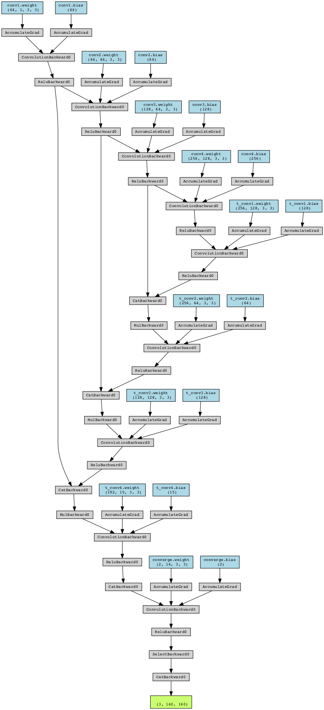

# ChromaNetApp
# ** STILL UNDER CONSTRUCTION ** 
Colorize any grayscale image from the 1800s to 1900s using AEs in PyTorch
**Updates: Still working to improve graphic quality + CUDA optimization**

# What is ChromaNet?
An AE that converts grayscale landscape images to coloured images.

For **@fleurcosmos**

**The architecture of the given ColorizationAutoencoder model is as follows:**

**Encoder Layers:**
Conv2d layer with input channel of 1, output channel of 64, kernel size of 3, stride of 1, and padding of 1
Conv2d layer with input channel of 64, output channel of 64, kernel size of 3, stride of 2, and padding of 1
Conv2d layer with input channel of 64, output channel of 128, kernel size of 3, stride of 2, and padding of 1
Conv2d layer with input channel of 128, output channel of 256, kernel size of 3, stride of 2, and padding of 1

MaxPool2d layer with kernel size of 2 and stride of 2

**Decoder Layers:**
ConvTranspose2d layer with input channel of 256, output channel of 128, kernel size of 3, stride of 2, padding of 1, and output padding of 1
ConvTranspose2d layer with input channel of 256, output channel of 64, kernel size of 3, stride of 2, padding of 1, and output padding of 1
ConvTranspose2d layer with input channel of 128, output channel of 128, kernel size of 3, stride of 2, padding of 1, and output padding of 1
ConvTranspose2d layer with input channel of 192, output channel of 15, kernel size of 3, stride of 1, and padding of 1

Dropout layer with a dropout rate of 0.2

**Converge Layer:**
Conv2d layer with input channel of 16, output channel of 2, kernel size of 3, stride of 1, and padding of 1

The model takes an input image with a single channel, applies several convolutional and max-pooling layers to encode it into a compressed representation, and then applies several transposed convolutional layers to reconstruct the original image. Finally, the model passes the reconstructed image through a converging convolutional layer to reduce the number of channels to 2. The output of the model is the compressed representation of the input image.

